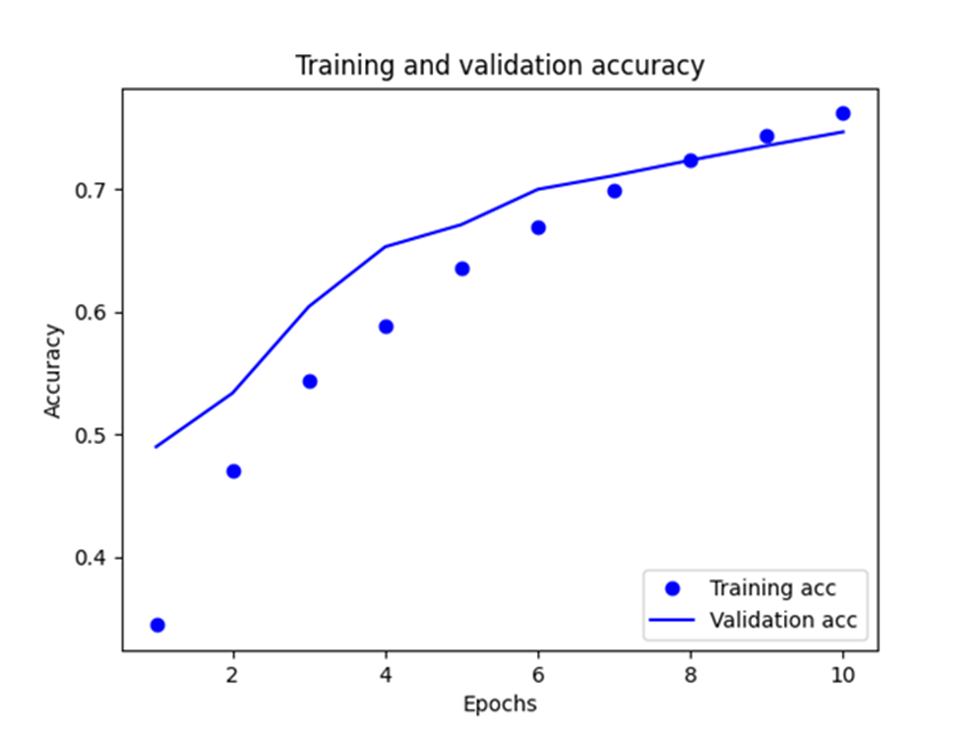
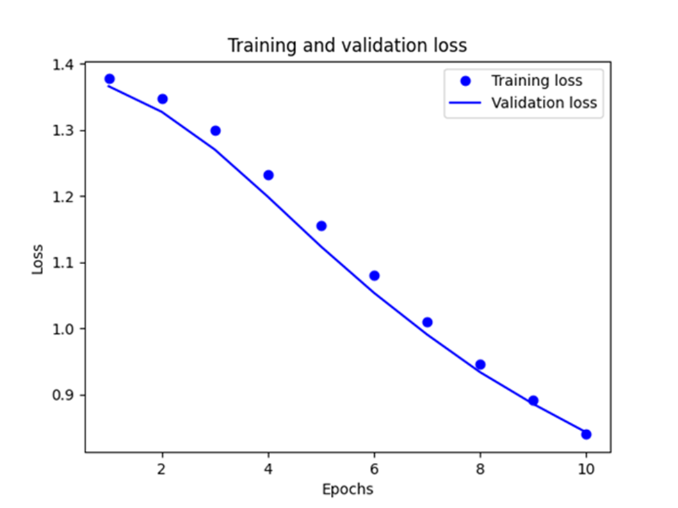

## Provide plots that describe the training and validation loss and accuracy. Interpret the plots. How is this model performing?

Training loss decreases with each epoch, and training accuracy increases with each epoch.
These changes are caused by using a gradient descent optimization. The usage of a gradient descent optimization minimizes the desired quantity on every iteration. While the validation loss undergoes a similar change, the validation accuracy seems to slightly peak before the training accuracy. Therefore, there could be slight overfitting.
Overfitting means that the model does better on the training data than on new data.

## Export the model and print the accuracy produced using the test data. Does the test data accuracy serve to validate your model?

Testing Data Accuracy: 0.7423750162124634
Training Data Accuracy: 0.8037

The test data accuracy is around 74%. In addition, the training data accuracy is around 80%. Due to the training data accuracy being slightly higher than the test data accuracy, the test accuracy validates the information that my model is slightly overfit.

## Produce three examples that are relevant to the multi-class classification model and predicting the language relevant to the stack overflow question. Produce the array generated by each of your three examples. Were these predictions accurate?

examples2 = ['get response...', 'why is length...', 'how to specify...']

export_model.predict(examples2)

array([[0.54705024, 0.46162388, 0.5459138 , 0.44582504],
[0.526513  , 0.47477025, 0.55174273, 0.4476406 ],
[0.53687304, 0.47287232, 0.5391565 , 0.45122647]], dtype=float32)

The arrays concerning the accuracy of the predictions seem to contain different accuracy values for each class. The classes involve csharp, java, javascript, python. To clarify, the position at index 0 in the array corresponds to csharp. The position at index 1 in the array corresponds to java. The position at index 2  in the array corresponds to javascript. The position at index 3 in the array corresponds to python. Therefore, the phrase ‘get response’ seems to be more correlated with the csharp classes than the other classes. The phrase ‘why is the length’ seems to be more correlated with the javascript class than the other classes. The phrase ‘how to specify’ seems to be more correlated with the javascript class than the other classes. However, due to the accuracy values in the array being very close to each other, I would be skeptical about these values. Therefore, I would not be confident in saying that these predictions were accurate. 

##Compare your multi-class model with your binary class model that predicted sentiment as either positive or negative in response to various movie reviews. What is the most significant difference between the two different types of models? Compare the two models and estimate which demonstrated better performance? Substantiate your response.

In the binary class model, validation loss and accuracy both peak before the training accuracy. In the multi-class model, the validation accuracy slightly peaks before the training accuracy. Based on this information, the binary class model could be more overfit than the multi-class model. Also, the testing accuracy of the binary class model is around 87%. The testing accuracy of the multi-class model is around 74%. Due to the binary class model having a higher testing accuracy, the binary class model is more accurate than the multi-class model. Therefore, the binary class model demonstrated better performance.

