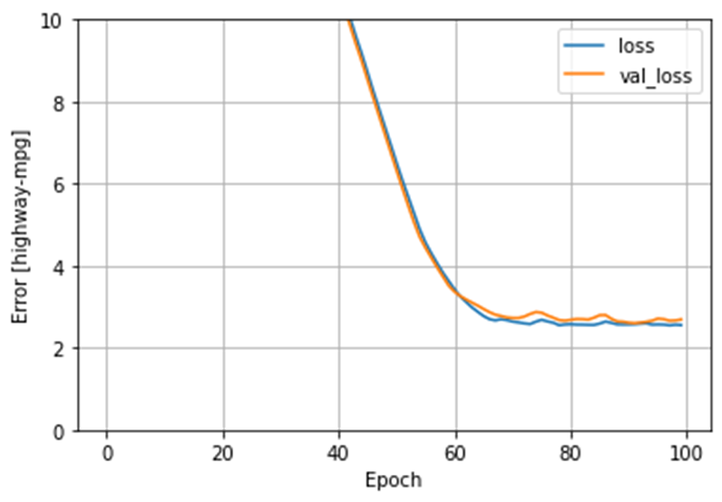
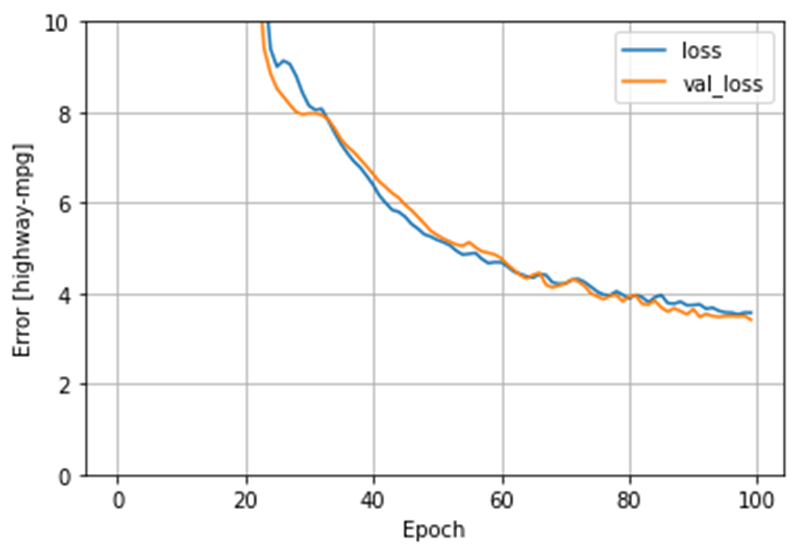

# Informal Responses for Monday 7/12/21

### Which of the two models produces a better loss metric (see this link for an explanation of the loss function). Produce a plot that supports your answer. 

For the first set of models, I used highway-mpg as target and num-of-cylinders, engine-size, horsepower, curb-weight as the features. When using multi-class linear regression, the mean absolute error for this model was around 2.051928. When using multi-class DNN regression, the mean absolute error for this model was around 3.362609. Due to the model created by the usage of multi-class linear regression having a lower mean absolute error, I would say that this model produces a better loss metric.

#### Graphs for First Set of Models

#### Linear Model

#### DNN Model

### Return to the remainder of the variables from the dataset and add additional continuous and categorical features with the intent of improving your loss metric. Produce a plot that demonstrates the value of your model. What is the best model your team was able to produce?
