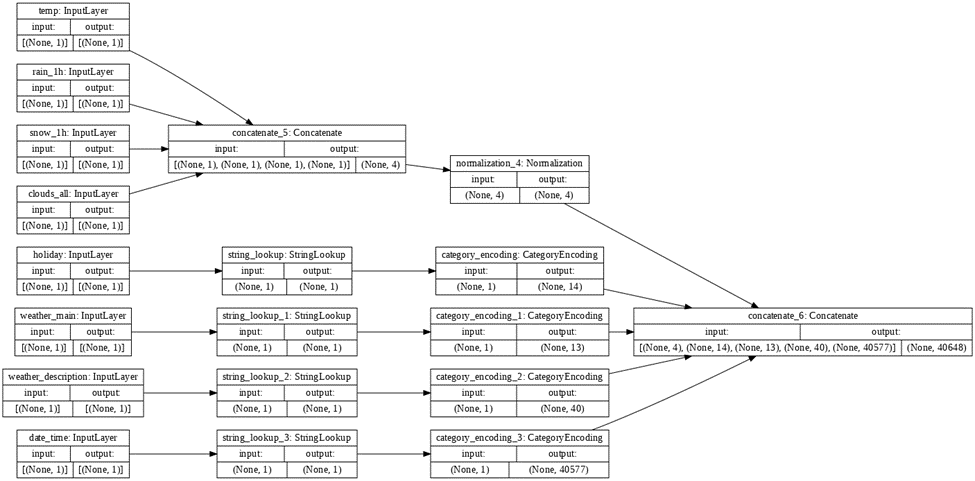
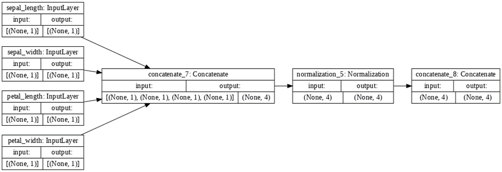

### Start with the Load CSV data script that we prepared during today's class. Following the Mixed data types section from the exercise, replace the titanic dataset first with the Metro Interstate Traffic Volume Data Set and then with the Iris Dataset. You can use the read_csv() command from the pandas package to pull these datasets from the following web addresses.

https://archive.ics.uci.edu/ml/machine-learning-databases/00492/Metro_Interstate_Traffic_Volume.csv.gz
https://storage.googleapis.com/download.tensorflow.org/data/iris_training.csv

### Use the plot_model() command from tf.keras.utils to produce the plot that describes the input preprocessing step. Describe the plot of each model for the two dataset preprocessing steps. What does each box in the illustration represent? Are there different paths towards the final concatenation step? What is occurring at each step and why is it necessary to execute before fitting your model. 

For the model involving the Metro Interstate Traffic Volume Data Set, the boxes in the illustration represent steps in preprocessing. Input layer boxes represents the features of this dataset being inputted in. In this step, the inputted information is collected. After these input layer boxes, the path towards the final concatenation step splits in two depending on whether an input is a numeric input or a string input. Both paths are needed to prepare numeric inputs and string inputs for the final concatenation. The concatenate_5 box involves the concatenating of the numeric inputs. The normalization_4 box involves the normalization of these numeric inputs. The StringLookup boxes involve mapping from strings to integer indices in a vocabulary for string inputs. In addition, the CategoryEncoding boxes represent creating a one-hot vector for each string input. The concatenate_6 box demonstrates concatenating all the preprocessed inputs together.

For the model involving the Iris Dataset, the boxes in the illustration also represent steps in preprocessing. Similarly, the input layer boxes symbolizes the features of this dataset being inputted in and inputted information being collected. However, there is no split in the path to the final concatenation step due to this dataset only having numeric inputs. The concatenate_1 box involves the concatenating of the numeric inputs. The normalization_1 box involves the normalization of these inputs. The concatenate_1 box represents concatenating all these preprocessed inputs together.

For both models, preprocessing is necessary to execute before fitting the models due to preprocessing supporting improvement in quality of raw data.

### Train each model and produce the output (not necessary to validate or test). Describe the model output from both the metro traffic interstate dataset and the iris flowers dataset. What is the target for each dataset? How would you assess the accuracy of each model? Are you using a different metric for each one? Why is this so? What is each one measuring?

After training the model with the Metro Interstate Traffic Volume Data Set, the loss calculated through mean squared error is revealed to be 3502187.75. Mean squared error is the square of the difference between actual and predicted target values. The target for this model is traffic volume. Due to this target not being a categorical variable and instead a continuous variable, I recommend using mean squared error as a metric of loss for this model.

After training the model with the Iris Dataset, the loss calculated through categorical cross entropy metric is revealed to be 1.2666e-07. This metric should be used when there are multiple label classes. This model currently has multiple label classes in the form of three species of flowers. The target for this model is the species of the flowers. Additionally, due to this target being a categorical variable rather than a continuous variable, I would like to further emphasize the importance of using the categorical cross entropy metric to calculate loss. In general, cross entropy metrics are used in calculating the difference between two probability distributions and calculating entropy between distributions. 

Overall, I would assess the accuracy of each model by comparing each model to other models with similar datasets and types of loss. If this model has a loss than the other models, I would say that this model is accurate. 
