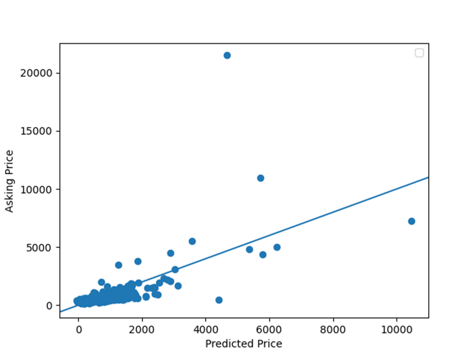

# MSE equation
mse = np.mean((data_v3['price'] - data_v3['Price Predictions']) ** 2)

mse

Project MSE --> 864,079

# Graphs
## Plot Model Loss

## Plot the asking price and predicted price for all of the homes in Denver, Colorado

## Zoomed In Graphs

# Questions

## How did your model fare?

To answer this question about how well my model did, I will look at my created graphs. According to graph involving the asking price and predicted price for all of the homes in Denver, Colorado, these price values for the homes matched sometimes. However, it does not look like these price values consistently matched together. The next graph I will mention is the graph involving model loss. To clarify, loss is the error over the training set. In this graph, model loss declines in the beginning and then starts oscillating at a lower value of model loss. Although the price values did match sometimes and model loss declined at the beginning, the lack of a consistent matching of price values and a consistent fall in model loss causes my model to be okay at best. 

## In your estimation is there a particular variable that may improve model performance?

To find out if there is a particular variable that may improve model performance, I decided to calculate more Mean Squared Error values. The first MSE value I calculated was from the model in which I used the input variables bathrooms, bedrooms, and living area to fit and predict the model. The first MSE value was around 864,079. The second MSE value I calculated was from the model in which I only used the input variable bathrooms to fit and predict the model. The second MSE value was around 1,125,439. The third MSE value I calculated was from the model in which I only used the input variable bedrooms to fit and predict the model. The third MSE value was around 1,393,646. The fourth MSE value I calculated was from the model in which I only used the input variable living area to fit and predict the model. The fourth MSE value was around 889,134. Out of all the models relying on just one input variable, the model with the input variable living area had the lowest Mean Squared Error Value. Therefore, out of all those models, this model would be considered the better model. Based on this information, it appears relying more on the input variable living area may improve model performance. 

To find more support for the input variable living area improving model performance, I made a correlation matrix with all the input variables and the price values. From this correlation matrix, I made a heatmap. This heatmap shows that the input variable living area has the strongest connection with the price values out of all the input variables. By relying more on this variable, I would be using a variable that is strongly correlated to my target price values. Therefore, relying more on this variable would help my model better predict price values. 

Based on all this information, there is a high chance that the input variable may improve model performance. 

## Which of the predictions were the most accurate? In which percent do these most accruate predictions reside? Did your model trend towards over or under predicting home values?

According to graph involving the asking price and predicted price for all of the homes in Denver, Colorado, lower predicted price values were more accurate than higher predicted price values. These lower predicted values appear up until the 75th percentile of the predicted price values, 813.37. After this percentile, the predicted price values become less and less accurate. This decrease in accuracy is demonstrated in more points drifting away from the line that represents very accurate predicted price values. To find out if my model trends towards over or under predicting values, I firstly added up conditions in which the price predictions were greater than the actual price. This sum of conditions was 169. Secondly, I added up conditions in which the price predictions were less than the actual price. This sum of conditions was 306. Due to there being a larger number of conditions in which the price predictions were less than the actual price, I would say that my model trended towards under predicting home values. 

## Which feature appears to be the most significant predictor?

Similar to Question 2, I used models with a single feature each to calculate Mean Squared Values. However, I had to use a different scale due to the larger variance in values used by this big group of features. Therefore, some of the previous MSE values look different from before. The model with the zip code feature had a MSE value of around 17032. The model with the longitude feature had a MSE value of around 15627. The model with the latitude feature had a MSE value of around 15627. The model with the year built feature had a MSE value of around 15626. The model with the bathrooms feature had a MSE value of around 15627. The model with the bedrooms feature had a MSE value of around 15627. The model with the living area feature had a MSE value of around 13984. Due to the model with the feature living area having the lowest Mean Squared Error Value, this model is considered to be the better model. Based on this information, it appears that the living area feature produces less errors than the other features. Therefore, the living area feature is most significant predictor.

Additionally, I created a correlation matrix with all the features. From this correlation matrix, I created a heatmap. This heatmap demonstrates again that the feature living area has the strongest correlation with the price values out of all the features. Based on this strong correlation, the feature living area is the most significant predictor of price values. 

### Overall, although I had problems with scaling, I think that my model ana analysis for Project 1 turned out okay. 