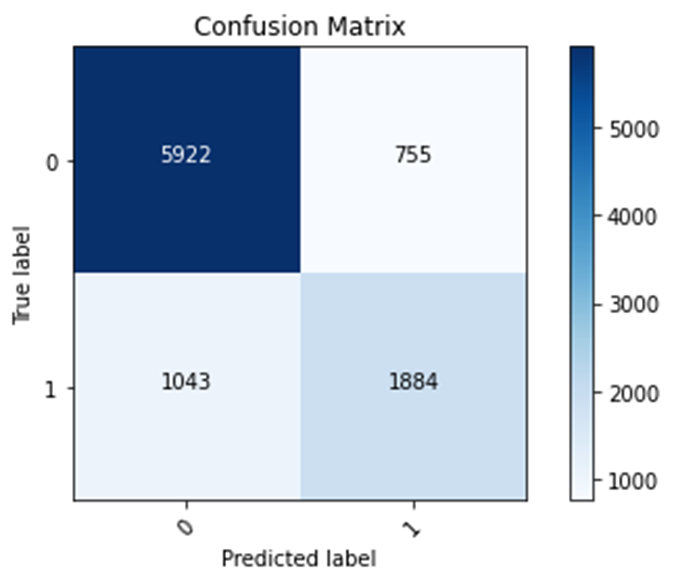

## Using the data and two models you produced in step 1, create a confusion matrix. You are welcome to use the following script. With your confusion matrix as a reference, analyze and discuss the two sets of results you produced.

The model focusing on Wealth Class 2 is the worst model, because it has the lowest testing accuracy value. This testing accuracy value is 0.7371. Testing accuracy is an important tool for analyzing data, because it helps the user see how accurate the model is on new data (or data that it was not trained on). The model focusing on Wealth Class 5 has the highest testing accuracy value, 0.9584. As seen in the confusion matrices, the code seems to be more likely to predict a label to be 0 (representing other wealth classes) rather than 1 (representing wealth class that is being focused on). This tendency of predicting a label to be 0 could be happening due to the other wealth classes having a stronger presence in the training data than the selected wealth class. In other words, the other wealth classes make up a larger portion of the training data than the selected wealth class. In addition, this tendency causes the model with wealth class 5 to have the highest accuracy and the model with wealth class 2 to have the lowest accuracy. Since the rich elites also known as wealth class 5 and label 1 in this model, the 1% of the world, make up a small portion of the dataset, having a tendency to predict the label to be the other wealth classes, label 0, allows for this model to be very accurate. However, since wealth class 2 makes up a much larger portion of the dataset, this tendency will cause the model focusing on wealth class 2 to have a much lower accuracy. In addition, wealth class 2 makes up a larger portion of the dataset due to more people being in lower social classes than higher social classes. Most people are not members of the rich elites.

### Wealth Class 1

Training accuracy: 0.8108

Testing accuracy: 0.8128

Confusion matrix, without normalization

[[5922  755]

[1043 1884]]

### Wealth Class 2 (worst)

Training Accuracy: 0.7435

Testing Accuracy: 0.7371

Confusion matrix, without normalization

[[6558  530]

[1995  521]]

### Wealth Class 3

Training accuracy: 0.8019

Testing accuracy: 0.7968

Confusion matrix, without normalization

[[7282  311]

[1641  370]]

### Wealth Class 4

Training accuracy: 0.9103

Testing accuracy: 0.9075

Confusion matrix, without normalization

[[8050  327]

[ 561  666]]

### Wealth Class 5 (best)

Training accuracy: 0.9636

Testing accuracy: 0.9584

Confusion matrix, without normalization

[[8507  228]

[ 172  697]]

## Again using either the Classify structured data with feature columns script or the Classify structured data using Keras Preprocessing Layers with the country_persons.csv dataset, specify, train and evaluate a model that predicts all class of wealth outcomes as a categorical target. Again create a confusion matrix in order to analyze and discuss your results. Revisit the Classify structured data with feature columns script or the Classify structured data using Keras Preprocessing Layers in order to modify your feature columns, in attempt to improve the accuracy of your model that uses all five categorical wealth classes as the target. Analyze and discuss your progress and results.

In my first model that uses all five categorical wealth classes as the target, I used the age feature as a bucketized column, the size, age, education features as numeric columns, the toilet, location, potable, electric, car, cook, gender features as categorical columns. In addition, I removed the missing values from the features potable, toilet, electric, car, cook, age, and education. In this model, I had a testing accuracy of 0.5729 and 5502 instances of predicted labels matching true labels. In my second model, I did the same actions as the first model. However, I also removed the don’t know values from the features age and education. In this model, I had a testing accuracy of 0.5791 and 5561 instances of predicted labels matching true labels. In my third model, I did the same actions of the first model and used the size and education features as bucketized columns. In this model, I had a testing accuracy of 0.5818 and 5588 instances of predicted labels matching true labels. In my fourth model, I aggregated the age and toilet features by having certain lists/ranges of feature values be represented by different numerical values. In addition, I used the size, age, education, toilet features as numeric columns and the location, potable, electric, car, cook, gender features as categorical columns. In this model, I had a testing accuracy of 0.5750 and 5522 instances of predicted labels matching true labels. My first model got more labels right when predicting lower wealth classes. Due to being trained on data in which lower wealth classes are the majority, this model has a higher chance to predict a label to be a lower wealth class. In addition, lower wealth classes contain more people than higher wealth classes. My other models increased their accuracy in comparison to the first model by focusing more on lower wealth classes and getting more predictions on lower wealth classes right. Overall, my other models improved upon my first model by putting the data into simpler terms. Simpler data allows for the data to be more easily processed in the model and support in making predictions more accurate. My fourth model improved upon the first model’s accuracy the least. Also, my third model improved upon the first model’s accuracy the most. Bucketized columns involve splitting feature values into different categories based on numerical ranges. Since my fourth model involved me doing a manual process similar to creating bucketized columns, it makes sense that my fourth model had a lower accuracy than my third model. Python, a computer language, was able to able to more efficiently split feature values into different categories than me, a human. 

### First Model

Training accuracy: 0.5806

Testing accuracy: 0.5729

Confusion matrix, without normalization

[[2034  784   73    3    0]

[ 805 1311  397   41    0]

[ 202  789  675  337   11]

[  18   84  192  775  152]

[   0    9   26  179  707]]

### Second Model

Training accuracy: 0.5768

Testing accuracy: 0.5791

Confusion matrix, without normalization

[[2309  523  103    0    0]

[1001 1003  464   23    0]

[ 281  621  812  314   16]

[  20   62  244  736  159]

[   0    2   31  178  701]]

### Third Model

Training Accuracy: 0.5805

Testing accuracy: 0.5818

Confusion matrix, without normalization

[[2354  557  103    0    0]

[ 922 1069  445   19    0]

[ 273  691  824  248    8]

[  21   69  298  646  137]

[   0    4   39  182  695]]

### Fourth Model

Training Accuracy: 0.5723

Testing accuracy: 0.5750

Confusion matrix, without normalization

[[2244  664   76    0    0]

[ 917 1190  372   31    0]

[ 298  731  708  302    8]

[  22   82  235  717  126]

[   0    4   23  191  663]]

