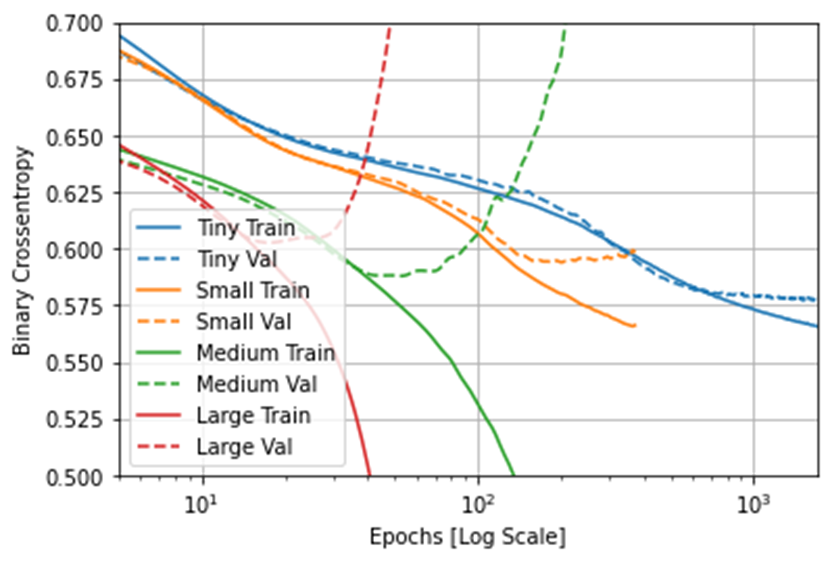
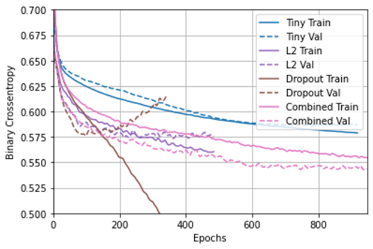
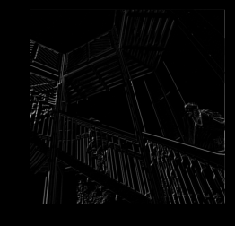
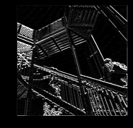
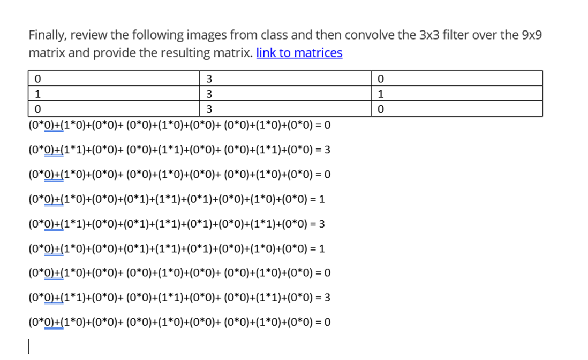

## Using the script you produced with the Higgs Dataset answer the following questions.

### Describe the dataset. What type of variable is the target? How many features are being used? How many observations are in the training dataset? How many are used in the validation set?

The Higgs Dataset is used as a classification problem that focuses on distinguishing between a signal process that produces Higgs bosons and a background process that does not. The data for the Higgs Dataset has been produced from Monte Carlo simulations. The dataset contains 11,000,000 examples. The target class is binary. In addition, it is a categorical type of variable. There are 28 features being used. In addition, the first 1,000 observations are used in the validation set. The next 10,000 observations are used in the training dataset. 

### How did each of the four models perform (tiny, small, medium and large)? Which of the four models performed the best? Which ones performed the worst? Why in your estimation did certain models perform better? Produce a plot that illustrates and compares all four models.

In the tiny model, both the validation metric and the training metric are moving in the same direction. Based on this information, everything in the tiny model is fine. In the small model, the validation metric is starting to stagnate, and the training metric is still improving. Based on this information, in the small model, I am likely close to overfitting. In the medium and large models, the validation metrics are going in the wrong direction. Because of this information, the medium and large models are clearly overfitting. Due to not overfitting and not being close to overfitting, the tiny model performed the best out of all the four models. Due to overfitting, the medium and large models performed the worst out of all the models. 

To clarify, in deep learning, a model's "capacity" is the number of learnable parameters in a model. The tiny model did well and did not overfit, because its capacity is located in the balance between "too much capacity" and "not enough capacity." However, the medium and large models did worse, because they had too much capacity. If the network has limited memorization resources, it will have difficulty in learning the mapping of larger models. 

### Apply regularization, then add a drop out layer and finally combine both regularization with a dropout layer. Produce a plot that illustrates and compares all four models. Why in your estimation did certain models perform better?

In this new plot, the tiny model did not overfit again. Due to its validation and training metrics moving in the same direction, the model with the "Combined" regularization also did not overfit and did well.
To clarify, the "Combined" regularizatin used both L2 regularization and the drouput regularization technique. L2 regularization involves penalizing the weights parameters of the model without making them sparse. When applied to a layer, the dropout regularization technique involves randomly "dropping out" or setting to zero a number of output features of the layer during training.
Through these regularization techniques, the "Combined" regularization model is able to become a simple model. For further clarification, simpler models have a higher chance of not overfitting than complex models. Additionally, a simple model is a model in which the distribution of parameter values has less entropy. 

### What is an overfit model? Why is it important to address it? What are four different ways we have addressed an overfit model thus far?

An overfit model is a model that performs very well on the training data and poorly on new data. In addition, it is a kind of model that has higher internal validity and lower external validity. Internal validity is how accurate a model's predictions are on the data it was trained on. External validity is how accurate a model's predictions are on data it was not trained on or how well it generalizes to new data.
Also, an overfit model is a type of model that has a higher accuracy on the training data and a lower accuracy on the testing data. 

The four different ways we have addressed an overfit model thus far involve getting more training data, reducing the capacity of the network, adding weight regularization, and adding dropout. 

### In this exercise you manually applied a 3x3 array as a filter to an image of two people ascending an outdoor staircase. Modify the existing filter and if needed the associated weight in order to apply your new filters to the image 3 times.

### Plot each result, upload them to your response, and describe how each filter transformed the existing image as it convolved through the original array and reduced the object size. 

filter = [ [-1, -1, -1], [-1, -1, -1], [-1, -1, 8]]

weight  = 1

After iterating over the image, leaving a 1 pixel margin, multiplying out each of the neighbors of the current pixel by the value defined in the filter, the filter transform the existing image to have a strong set of both vertical and horizontal lines.

filter = [ [1, 0, 0], [0, 0, 0], [0, 0, -1]]

weight = 1

After iterating over the image, leaving a 1 pixel margin, multiplying out each of the neighbors of the current pixel by the value defined in the filter, the filter transform the existing image to have a weak set of both vertical and horizontal lines. 

filter = [ [3, -3, 0], [3, -3, 0], [3, -3, 0]]

weight = 1

After iterating over the image, leaving a 1 pixel margin, multiplying out each of the neighbors of the current pixel by the value defined in the filter, the filter transform the existing image to have a predominantly strong set of vertical lines. In addition, this change causses the image to have a weaker set of horizontal lines in comparison to the strong vertical lines.

### What are you functionally accomplishing as you apply the filter to your original array? Why is the application of a convolving filter to an image useful for computer vision? 

When applying the filter to my original array, I am scanning every pixel in the image, looking at its neighboring pixels, and multiplying out the values of these pixels by the equivalent weights in a filter. To clarify, a convolution is a filter that passes over an image, processing it, and extracting features that show a commonality in the image. Also, computer vision is an interdisciplinary scientific field that deals with how computers can gain high-level understanding from digital images or videos. Computers start to gain high-level understanding from digital images or videos through convolution helping them extract features that show a commonality in the image. 

### Another useful method is pooling. Apply a 2x2 filter to one of your convolved images, and plot the result. In effect what have you accomplished by applying this filter? Does there seem to be a logic (i.e. maximizing, averaging or minimizing values?) associated with the pooling filter provided in the example exercise (convolutions & pooling)? Did the resulting image increase in size or decrease? Why would this method be useful?
I applied a 2x2 filter to my convolved image with the filter = [ [3, -3, 0], [3, -3, 0], [3, -3, 0]]
and the weight = 1.

By applying this 2x2 filter from the example exercise, I have maintained the extracted features while reducing the image to 1/4 the size of the original image. 
These extracted features include a strong set of vertical lines and a weaker set of horizontal lines. 
Therefore, I am both reducing the overall amount of information in the image and maintaining the detected features. 
When using the 2x2 pooling filter provided in the example exercise, we are using max pooling. Max pooling involves iterating over an image, looking at a pixel and its immediate neighbors, taking the largest of them, and loading this largest into the new image. 
Overall, this method would be useful, because pooling reducing image size and maintaining features of images will allow code using these images to be more efficient. The code will be more efficient due to data from the images now being classified based on features rather than raw pixels. 

#### Finally, review the following images from class and then convolve the 3x3 filter over the 9x9 matrix and provide the resulting matrix.

