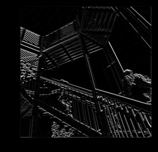

### In this exercise you manually applied a 3x3 array as a filter to an image of two people ascending an outdoor staircase. Modify the existing filter and if needed the associated weight in order to apply your new filters to the image 3 times.

### Plot each result, upload them to your response, and describe how each filter transformed the existing image as it convolved through the original array and reduced the object size. 

filter = [ [-1, -1, -1], [-1, -1, -1], [-1, -1, 8]]

weight  = 1

After iterating over the image, leaving a 1 pixel margin, multiplying out each of the neighbors of the current pixel by the value defined in the filter, the filter transform the existing image to have a strong set of both vertical and horizontal lines.

filter = [ [1, 0, 0], [0, 0, 0], [0, 0, -1]]

weight = 1

After iterating over the image, leaving a 1 pixel margin, multiplying out each of the neighbors of the current pixel by the value defined in the filter, the filter transform the existing image to have a weak set of both vertical and horizontal lines. 

filter = [ [3, -3, 0], [3, -3, 0], [3, -3, 0]]

weight = 1

After iterating over the image, leaving a 1 pixel margin, multiplying out each of the neighbors of the current pixel by the value defined in the filter, the filter transform the existing image to have a predominantly strong set of vertical lines. In addition, this change causses the image to have a weaker set of horizontal lines in comparison to the strong vertical lines.

### What are you functionally accomplishing as you apply the filter to your original array? Why is the application of a convolving filter to an image useful for computer vision? 

When applying the filter to my original array, I am scanning every pixel in the image, looking at its neighboring pixels, and multiplying out the values of these pixels by the equivalent weights in a filter. To clarify, a convolution is a filter that passes over an image, processing it, and extracting features that show a commonality in the image. Also, computer vision is an interdisciplinary scientific field that deals with how computers can gain high-level understanding from digital images or videos. Computers start to gain high-level understanding from digital images or videos through convolution helping them extract features that show a commonality in the image. 

### Another useful method is pooling. Apply a 2x2 filter to one of your convolved images, and plot the result. In effect what have you accomplished by applying this filter? Does there seem to be a logic (i.e. maximizing, averaging or minimizing values?) associated with the pooling filter provided in the example exercise (convolutions & pooling)? Did the resulting image increase in size or decrease? Why would this method be useful?
I applied a 2x2 filter to my convolved image with the filter = [ [3, -3, 0], [3, -3, 0], [3, -3, 0]]
and the weight = 1.

By applying this 2x2 filter from the example exercise, I have maintained the extracted features while reducing the image to 1/4 the size of the original image. 
These extracted features 
Therefore, I am both reducing the overall amount of information in the image and maintaining the detected features. 
When using the 2x2 pooling filter provided in the example exercise, we are using max pooling. Max pooling involves iterating over an image, looking at a pixel and its immediate neighbors, taking the largest of them, and loading this largest into the new image. 

#### Finally, review the following images from class and then convolve the 3x3 filter over the 9x9 matrix and provide the resulting matrix.

