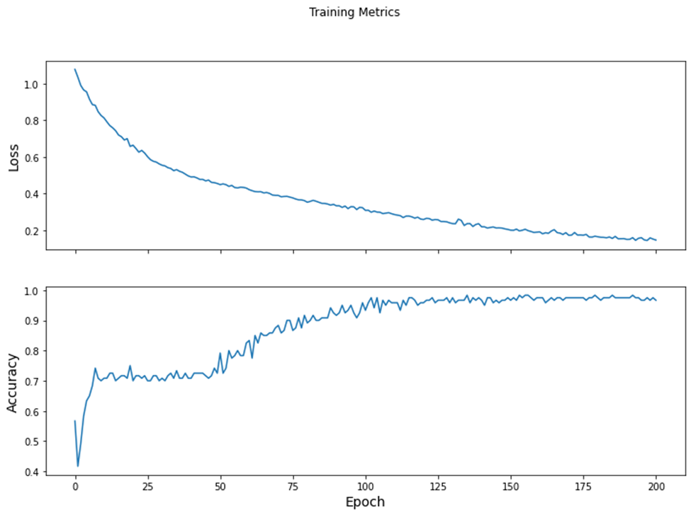

## Using the Custom training: walkthrough script we developed during today's class, write a 1-1/2 to 2-page report that provides a description of the following.

-the data used in the model

-how you created the tf.dataset

-how you specified your model architecture, including the input shape, the layers and other functions

-how you trained the model

-how you optimized the model

-how you estimated loss including a plot that describes that change per epoch

-how you evaluated the model with your test dataset

-how you made some predictions, including three new ones of your own and their results

The data in the model includes 120 Iris flowers along with their sepal and petal measurements. To be more specific, each Iris flower has four features with float numbers and one of three possible label names. The four features are sepal length, sepal width, petal length, petal width, and species. In addition, the label names for this data involves the kinds of Iris flowers. The kinds of Iris flowers used in this model include Iris setosa, Iris virginica, and Iris versicolor. These label names are the values I want to predict and are integer values of 0, 1, or 2 that correlate to one of the kinds of flowers. 0 correlates to Iris setosa. 1 correlates to Iris versicolor. 2 correlates to Iris virginica. When relying on this data, the batch size of 32, feature names, label names, and 1 epoch, the function tf.data.experimental.make_csv_dataset can parse the data into a suitable format. This suitable format is a tf.data.Dataset of (features, label) pairs. In these pairs, features is a dictionary, {‘feature_name’: value}. Also, the objects in this Dataset are iterable. Due to the data in the model being a CSV-formatted text file, this function is the best function for this action. Because of this function mainly being used to generate data for training models, the default nature of this function is to shuffle data and repeat the dataset forever. After utilizing the tf.data.Dataset#map method to pack the features of each pair into the training dataset, I built my model through the code model = tf.keras.Sequential([tf.keras.layers.Dense(10, activation=tf.nn.relu, input_shape=(4,)), tf.keras.layers.Dense(10, activation=tf.nn.relu), tf.keras.layers.Dense(3)]). The model being created is a tf.keras.Sequential model, a linear stack of layers. Also, the function tf.keras.layers.Dense indicates that this model uses two dense layers with ten nodes each and a dense output layer with three nodes. The three nodes are representations of the three kinds of Iris flowers used in this model as target values. The input_shape parameter used in the first dense layer is representing the number of features in the dataset. In this code for the model, the activation function is used in forming the output shape of each of the ten nodes of the two dense layers. To clarify, an activation function is a function that takes the weighted sum of all the inputs from the previous layer as an input and then makes an output value that is passed onto the next layer. In this case, the two dense layers are using the Rectified Linear Unit activation function that gives an output of zero if the input is negative or zero and an output equal to the input if the input is positive. This activation function is commonly used in hidden layers. After setting up the model, I trained the model to have it learn the dataset. This training stage involves minimizing the model’s loss or optimizing the model. Loss computes how wrong a model’s predictions in comparison to the desired labels. In this model, loss is calculated through the tf.keras.losses.SparseCategoricalCrossentropy function that uses the model’s class probability predictions and the desired labels as inputs and gives outputs of the average losses across examples. The optimizer uses gradients, vectors of partial derivatives of the model function, calculated through the tf.GradientTape context on the model’s variables to minimize the loss function. It involves the stochastic gradient descent algorithm and setting the learning_rate. Generally, gradient descent depends on iteratively changing the model’s parameters to find the best combination of weights and bias to minimize loss. The learning_rate is a hyperparameter that can be adjusted to get better results. Using the loss function, gradients, and the optimizer, I constructed a training loop to assist in helping the model make better predictions. The num_epochs variable determines how many times to loop over the dataset collection. In each epoch, pass through the dataset, of the training loop, the features and label of each example in the training dataset are obtained. The example’s features are used to make a prediction on the label, and this prediction is compared with the label. In addition, the optimizer and gradients are used to update the model’s variables. In each epoch, each batch of 32 in the training dataset uses the loss function to calculate the loss value. The epoch loss value is computed through using the mean metric to average the batch’ loss values. The epoch accuracy value utilizes the Sparse Categorical Accuracy metric to discover how often predictions match integer values in the training dataset batches of 32. I used the lists train_loss_results and train_accuracy_results to keep the results of the epoch loss values and epoch accuracy values. These lists help plot a graph that visualizes these results. 

