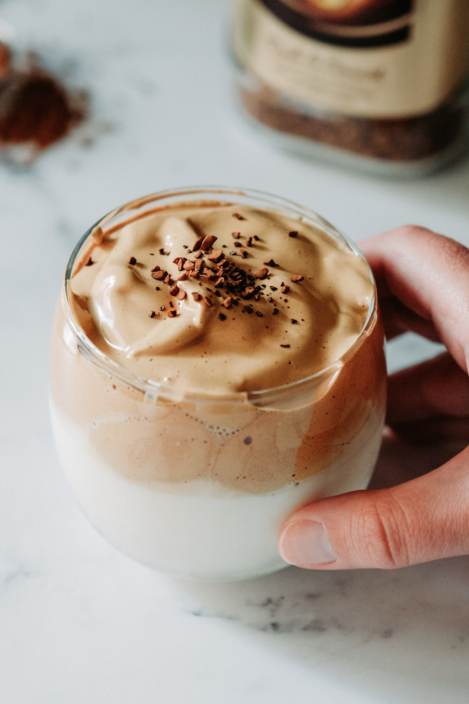
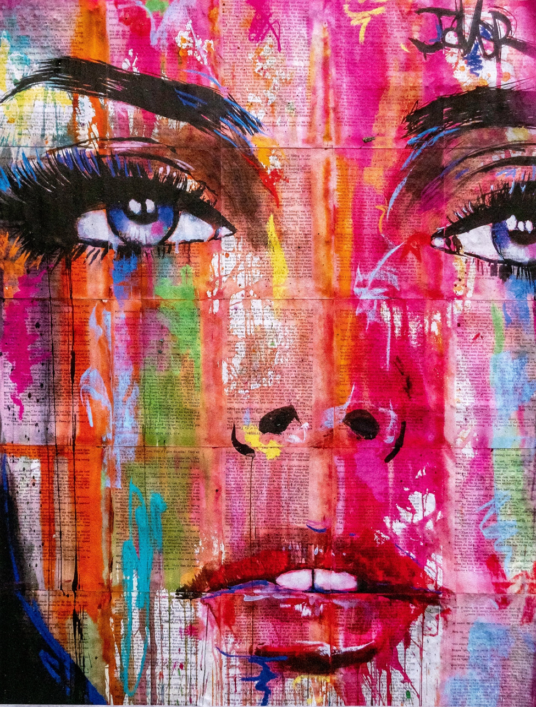
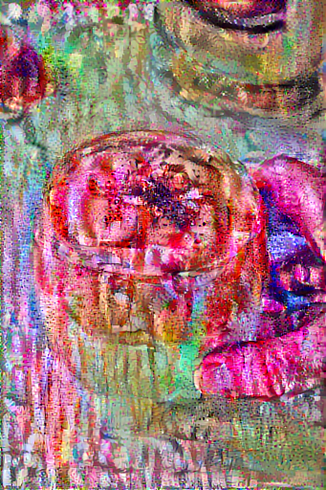
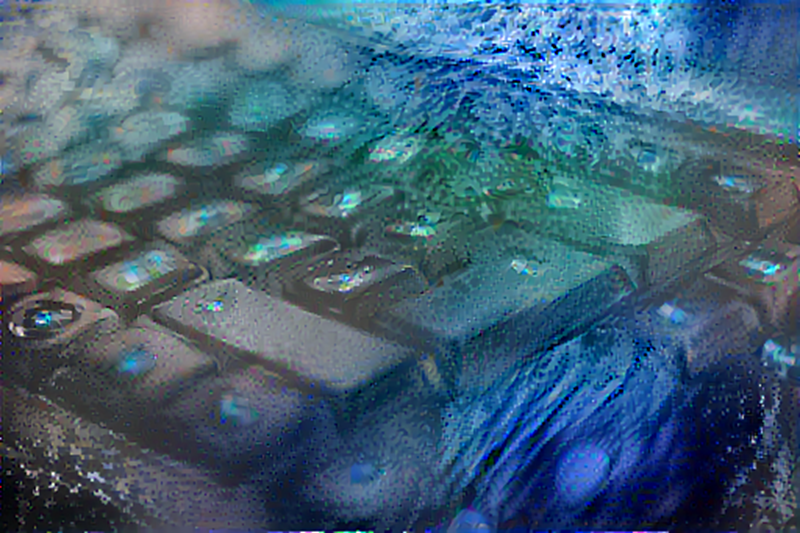

# Define content and style representations
To avoid getting the error “Unknown image file format. One of JPEG, PNG, GIF, BMP required. [Op:DecodeImage],” I used file paths as the content path and style path. Then, I used the function load_img to use the content path and style path to load the images and limit their maximum dimension to 512 pixels. Also, I labelled the image from the content path as the content image. I labelled the image from the style path as the style image. In addition, I used the intermediate layers from the VGG19 network to represent the style and content of the input images. The VGG19 network is a pretrained image classification network that involves very deep convolutional networks for large-scale image recognition. To be more specific, these intermediate layers allow me to describe and style of the input images. In other words, they help extract complex features from raw images and output classification labels.
# Extracting style and content
I extracted style and content by using a model that returns the style and content tensors. When used on images, this model outputs the gram matrix (style) of the style_layers and content of the content_layers.
# Implementing the style transfer algorithm 
The style transfer algorithm was implemented due to me computing the mean square error for my image’s output relative to each target and calculating the weighted sum of these losses. To be more specific, I first set my style and content target values. Then, I made a tf.Variable contain the content image so that it can be optimized. Due to this image being a float image, I used the function clip_0_1(image) to keep the pixel values between 0 and 1. In addition, I created an optimizer through Adam. To clarify, this optimizer involves a stochastic gradient descent method that is based on adaptive estimation of first-order and second-order moments. Also, I used the style weight of 1e-2, the content weight of 1e4, and the function style_contnet_loss(outputs) to discover the total loss through the weighted combination of the style loss and content loss. Afterwards, I used tf.GradientTape to update the image. tf.GradientTape is normally used for recording operations for automatic differentiation. After some testing, I realize that I am able to create an output image that has appearance of the content image but is “painted” in the style of the style image. After using a longer optimization, the style of the style image is more evident in this output image. In this step with longer optimization, I used 10 epochs and 100 steps per epoch. 
# Apply regularization term on the high frequency components
A negative of this basic implementation of the style transfer algorithm is this implementation producing a lot of high frequency artifacts. To reduce this production, an explicit regularization term, total variation loss, should be used on the high frequency components of the image. Like Sobel edge detectors, these high frequency components are basically edge-detectors. Also, this total variation loss is the sum of the squares of the values. After choosing the weight for the total variation loss to be 30, I included it in the train_step function that is involved in use tf.GradientTape to update the image. In addition, after using the tf.Variable on the content image again, I ran the longer optimization and obtained another highly stylized image.
# Comment on what your work means in terms of your development as a data scientist at William & Mary with forethought to the future (please feel free to take as much artistic license as you wish when answering this last question).
Overall, I used an image of waves as style image and an image of a keyboard to make my stylized image. My stylized image represents how I have become adaptable like waves when working on python thanks to my summer training in this computer language. This computer language is represented in the stylized image through the content image of keyboard. Lastly, I will take this lesson of adaptability into my upcoming Fall 2021 Data Science course. 
## Practice Content Image

## Practice Style Image

## Practice Stylized Image

## Content Image

## Style Image

## Stylized Image
