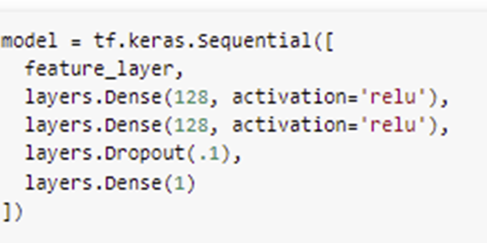
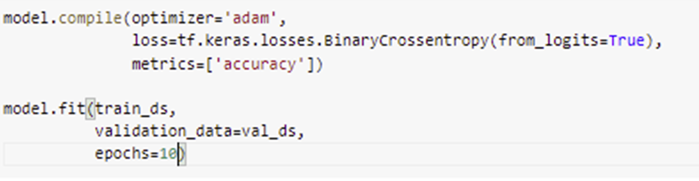
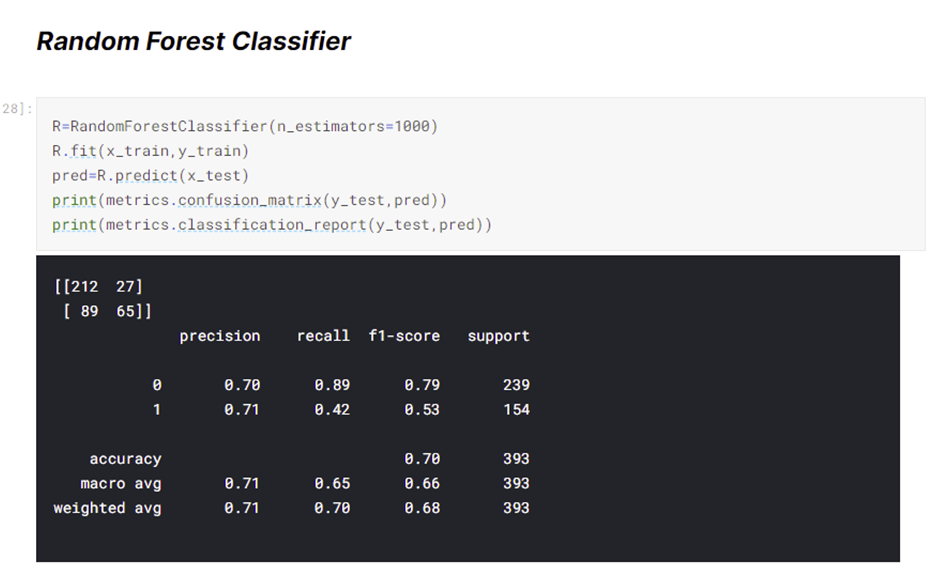

## Title
Predicting the Potability of Water
## Abstract 
Potable water is water that is fit or suitable for drinking. The benefits of drinking potable water include increasing energy, reducing fatigue, supporting weight loss, removing toxins from the body, and assisting in the digestion of food and prevention of constipation. On the other hand, drinking contaminated water can cause people to have diarrhea, stomach cramps, vomiting, and pneumonia. If you drink water with contaminants like arsenic, you can increase your chance of developing cancer. Although water treatment methods like boiling water for at least an hour, filtering water through ceramic filters, and filtering water through simple carbon-activated filters can remove many contaminants from tainted water, they cannot take out all the contaminants from the water. However, I plan to use the features of potable water such as pH, capacity of water to precipitate soap in mg/L, total dissolved solids in ppm, amount of Chloramines in ppm, amount of Sulfates dissolved in mg/L, conductivity, amount of organic carbon in ppm, amount of Trihalomethanes in μg/L, turbidity in making a model to predict potability. To make this model have a higher chance of accurately predicting potability, I plan to experiment with different combinations of these numerical features in the model. If I can figure out what combination of features helps increase the model’s accuracy, I could find out the features necessary to differentiate between contaminated and potable water. In addition, this discovery could lead to a way to perfectly converted contaminated water into potable water.

## Problem Statement

## Description of Data
-Source of Data: Kaggle --> [here](https://www.kaggle.com/adityakadiwal/water-potability)

-Continuous Features: 

+ pH (It is a measure used in determining the acid-base balance of water & indicating. The World Health Organization says that for most safe drinking water the pH values should range from 6.5 to 8.5. Generally, lower pH values are correlated with higher potential levels of corrosion.)

+ Hardness (It is the water's ability to precipitate soap and is usually a result of calcium and magnesium. Usually, the hardness for safe drinking water should not exceed 120 to 170 mg/L.)
  

+ Solids (This measure of water is also known as Total dissolved solids or TDS. 500 ppm of TDS usually should be the maximum amount of one's drinking water. However, any water sample exceeding 1000 ppm of TDS is unsafe.)
  

+ Chloramines (Chloramines are disinfectants involved in treating drinking water and in public water systems. According to Centers for Disease Control and Prevention, water samples containing chloramine levels up to 4 ppm are considered safe. Drinking small quantities of chloramine does not lead to harmful health effects and protects against waterborne disease outbreaks.)
  

+ Sulfate (Sulfates are natural substances located in minerals, soil, rocks, ambient air, groundwater, plants, and food. They are mainly used in the chemical industry. Water samples with 250 mg/L of sulfates should ensure that humans drinking the water will avoid the esthetic effects of sulfate. In addition, water samples should not go beyond 500 mg/L of sulfates to avoid the laxative effects of sulfates.)
  

+ Conductivity (Electrical conductivity is a measure of the ionic process of a solution that allows it to transmit a current. Conductivity and TDS seem to be related due to the quantity of dissolved solids in water usually determining the electrical conductivity. The World Health Organization states that Electrical Conductivity values in safe water samples should not be larger than 400 μS/cm.)
  

+ Organic Carbon (Total Organic Carbon measures how much carbon is in organic compounds in pure water. Usually, Total Organic Carbon values in safe drinking water go up to 25 ppm.)
  

+ Trihalomethanes (Trihalomethanes are chemicals that can be located in water treated with chlorine. Water samples with trihalomethane levels below or around 80 ppm or 80000 μg/L are considered safe for drinking.)
  

+ Turbidity (Turbidity is used to measure light emitting properties of water and is related to the quantity of solid matter present in water. The units used in this measurment is Nephelometric Turbidity Units. For safe drinking water, turbidity values should be lower than 5 NTU.)

-Discrete Target: Potability (This target specifies if water is safe for human use or not & uses values 0 and 1. 1 means that water sample is potable. 0 means that water sample is not potable)

-Description of Dataset Size: 3276 rows / observations x 10 columns (9 features / variables + 1 target)

-(After using dropna method to remove null values from the dataset) Description of Dataset Size: 2011 rows / observations x 10 columns (9 features / variables + 1 target)

-Size of Dataset: 337 KB

+ However, potable ranges in the dataset differ some from the general safety measures of potable water. For potable water of this dataset, pH values range from 0.2275 - 11.8981. Hardness values range from 73.4922 to 317.3381 mg/L. Values of Total dissolved solids range 1198.9437 to 56488.6724 ppm. Values of Chloramines range from 1.3903 to 13.127 ppm. Sulfate values range from 129 to 481.0306 mg/L. Conductivity values range from 201.6197 to 695.3695 μS/cm. Organic Carbon values range from 2.2 to 23.6043 ppm. Trihalomethanes values range from 8.577 to 124 μg/L. Turbidity valeus range from 1.45 to 6.4947 NTU.   

+ Due to the dataset's potable range for pH values, there are only 427 observations out of 811 potable observations from the dataset that are in the actual potable range of pH values, 6.5 to 8.5. For Hardness, there are only 180 observations out of the dataset's 811 potable observations that do not exceed the max recommended 170 mg/L of Hardness for safe drinking water. For Chloramines, 27 observations out of the dataset's 811 potable observations are below or equal to the recommended 4 ppm of Chloramines. Out of the dataset's 811 potable observations, only 325 of these observations are below or equal to the recommended 400 μS/cm for conductivity. In addition, only 739 observations of the dataset's 811 potable observations follow the rule of not going beyond 5 NTU for turbidity values.
+ All of the dataset's potable observations have organic carbon values that are under or equal to the recommended 25 ppm of organic carbon. For Sulfate, all observations from the dataset's 811 potable observations are below or equal to the max recommended 500 mg/L of sulfate. All of dataset's potable observations follow the recommended rule of not going beyond 80000 μg/L for trihalomethanes values. 
+ For Solids, there are no observations from the dataset's 811 potable observations that are under or equal to the recommended 1000 ppm of TDS. 
+ All the features involve float64 Dtype. The potability target has a Dtype of int64.
-Source: The data was collected from 3276 different water bodies. I think that these different water bodies are pre-treatment water bodies, because not all the water samples follow the recommended treatment rules for safe drinking water for the values of pH, Hardness, Solids, Chloramines, Conductivity, Turbidity.
  
# Model 

For my first model, I used solids, turbidity, chloramines, organic carbon, and conductivity features as numeric columns and bucketized columns. For my second model, I used the same features from my first model and added in two new features, sulfate and pH, as numeric and bucketized columns. For my third model, I used the same features from my second model and added in two new features, trihalomethanes and hardness, as numeric and bucketized columns. For my fourth model, I used the same features from my third model and also started focusing on crossed feature columns. In this model, since the quantity of dissolved solids in water usually determines the electrical conductivity, I used this relationship as a crossed feature column. Since turbidity is related to the quantity of solid matter present in water, I also used the relationship between turbidity and solids as a crossed feature column. In addition, due to trihalomethanes being chemicals that can be located in water treated with chlorine, I used the relationship between trihalomethanes and chloramines as another crossed feature column.

For all my models, I had a feature layer as an input layer, two dense layers that used 128 nodes and rectified linear unit activation, a dropout layer, and a dense output layer with one node. For further clarification, the dropout layer randomly had input units be 0 with a frequency of 0.1 at each step during training time to prevent overfitting. Inputs that are not set to 0 will be scaled up by 1.11111111111 (1/(1 - rate), 1/(1-.1)) to have the sum over all inputs be unchanged. In addition, the dense output layer has one node due to the target values being either 0 or 1. When compiling the model, I used the Adam optimizer. To clarify, Adam optimization is a stochastic gradient descent method that developed from adaptive estimation of first-order and second-order moments. Additionally, I used the Binary Cross entropy loss metric due to my target potability only having two label classes (0 and 1). When fitting the model, I used a training dataset made from the training data, function df_to_dataset, and a batch size of 32.  In addition, I used validation dataset created from the validation data, function df_to_dataset, metric shuffle being False, and a batch size of 32. Another action I did when fitting the model was using 10 epochs.
# Conclusion
The first model has a testing accuracy of 0.6005. The second model has a testing accuracy of 0.6129. The third model has a testing accuracy of 0.6203. The fourth model has a testing accuracy of 0.6303. 

The [Kaggle User Rohit](https://www.kaggle.com/rohitrajurocks/my-water-quality-analysis-accuracy-71) uses standard scaler, random forest classifier, and n_estimators of 1000 to get a testing accuracy of around 71%. To clarify, a random forest involves fitting a number of decision tree classifiers on various sub-samples of the dataset and using averaging to improve the predictive accuracy and control over-fitting. Also, he removed observations that had pH values greater than 12, hardness values greater than 300 mg/L, solids values greater than 45000 ppm, chloramines values greater than 12 ppm, and conductivity values greater than 650 μS/cm. 

To get the high testing accuracy like Rohit’s testing accuracy, I recommend finding a replicate the methods of a random forest classifier into a neural network model. In addition, I can use a standard scaler, more dense hidden layers in my model, and use more features in the dataset to improve the accuracy of my model. To be more specific, the features I want added to the dataset would focus on where the water samples were taken and what kinds of bodies of water are these samples taken from. Due to some potable observations in the dataset not having features’ values in the actual safe ranges for potable water, I think that news features would clarify this problem and encourage water samplers to be more conscious of where they are getting their water samples. In addition, adding categorical features to the model could diversify the feature layer and could improve the model’s accuracy. Similar to what Rohit did, I think that I should also remove potable observations that do not follow the actual safe ranges of the features’ values from the dataset. 
