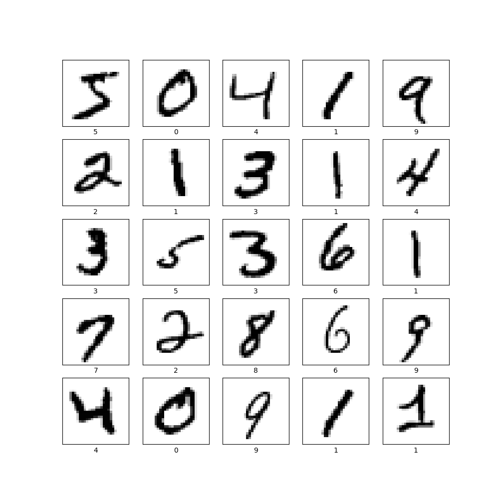

### Plot of 25 handwritten numbers from the data with their labels indicated below each image

plt.figure(figsize=(10,10))

for i in range(25):

plt.subplot(5,5,i+1)

plt.xticks([])

plt.yticks([])

plt.grid(False)

plt.imshow(train_images[i], cmap=plt.cm.binary)

plt.xlabel(train_labels[i])

plt.show()

