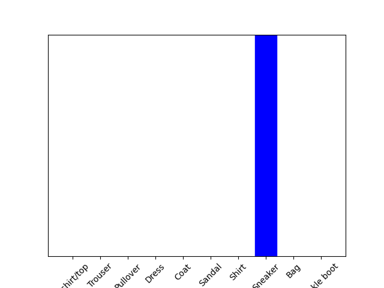

###img = test_images[999]

###predictions_single = probability_model.predict(img)

###print(predictions_single)

[[1.4758744e-08 5.4043760e-08 7.6920964e-10 8.1633957e-11 6.0252864e-10
4.6772367e-04 9.6401727e-11 9.9916601e-01 2.1067141e-08 3.6628015e-04]]

###plot_value_array(999, predictions_single[0], test_labels)

###_ = plt.xticks(range(10), class_names, rotation=45)

###plt.show()

###np.argmax(predictions_single[0])
--> 7
###test_labels[999]
-->7

