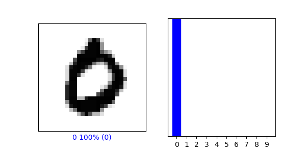
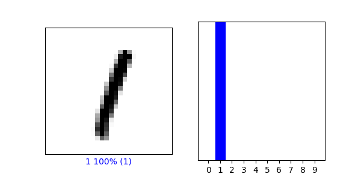

# First Image
i = 3

plt.figure(figsize=(6,3))

plt.subplot(1,2,1)

plot_image(i, predictions[i], test_labels, test_images)

plt.subplot(1,2,2)

plot_value_array(i, predictions[i],  test_labels)

plt.show()

# Second Image

i = 5

plt.figure(figsize=(6,3))

plt.subplot(1,2,1)

plot_image(i, predictions[i], test_labels, test_images)

plt.subplot(1,2,2)

plot_value_array(i, predictions[i],  test_labels)

plt.show()

