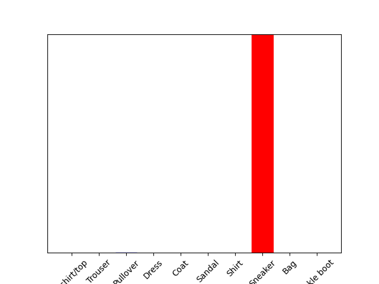

# Responses for 7/7/21

## From the Preprocess the data section of the script, modify the training image to produce three new images.

### New Image #1
-[New Image 1](NewImage1.md)

### New Image #2
-[New Image 2](NewImage2.md)

### New Image #3
-[New Image 3](NewImage3.md)

## Under the Make predictions section, present the array of predictions for an image from the test set other than the one given in the example script.

probability_model = tf.keras.Sequential([model, tf.keras.layers.Softmax()])

predictions = probability_model.predict(test_images)

predictions[1]

array([7.1652730e-06, 5.0723611e-15, 9.9805683e-01, 7.4160178e-10,
6.1433221e-04, 2.4728529e-16, 1.3216519e-03, 4.8570981e-22,
2.7355423e-10, 1.1303254e-15], dtype=float32)

### What does this array represent?

This array represents the model's "confidence" that this image is correlated to 
the t-shirt/top, trouser, pullover, dress, coat, sandal, shirt, sneaker, bag, and ankle boot.
For further clarification, the first value in this array represents the model's confidence that this image is a t-shirt/top.
Additionally, the last value in this array represents the model's confidence that this image is an ankle boot.

### How were the Softmax() and argmax() functions applied?

The Softmax() function was used to calculate the probabilities of images corresponding to each of the different articles of clothing.
The argmax() function was used to infer what article of clothing an image corresponds to based on the image having the highest probability of belonging in this class of clothing.

### Does the output from np.argmax() match the label from your test_labels dataset?
Yes, the output from np.argmax() does match the label from my test_labels dataset.
Due to np.argmax(predictions[1]) and test_labels[1] both equaling 2, this image has been correctly classified as a pullover.

### Under the Verify predictions section, plot two additional images (other than either of the two given in the example script) and include the graph of their predicted label as well as the image itself.

-[1st image](1stimage.md)

-[2nd image](2ndimage.md)

### Under the Use the trained model section, again select a new image from the test dataset. Produce the predictions for this newly selected image. Does the predicted value match the test label? Although you applied the argmax() function in this second instance, you did not use Softmax() a second time. Why is that so (please be specific)?

